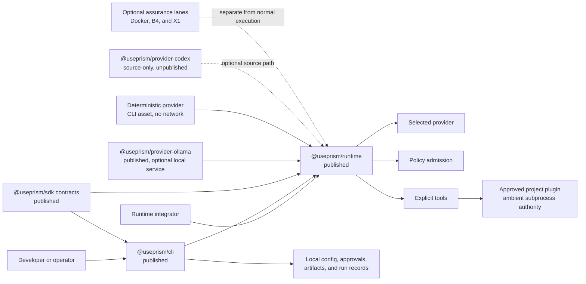

# Prism

[](https://github.com/cbolden15/prism/actions/workflows/ci.yml)
[](LICENSE)

<!-- pnh:limitation:PNH-CLAIM-17:begin -->
Prism 0.1.0 is a public developer preview for running bounded, goal-oriented
agent workflows. The APIs and behavior may change before a stable release.
<!-- pnh:limitation:PNH-CLAIM-17:end -->

Prism is a provider-neutral TypeScript runtime for bounded, inspectable agent
execution with pluggable providers, policies, and tools.

- Use the same provider, policy, and tool contracts across CLI and library code.
- Bound provider turns, tool calls, bytes, and elapsed time for each execution.
- Inspect ordered events, usage, terminal status, and local cleanup evidence.

Use Node.js 26.8.1 and npm 11.19.0.

## Deterministic first run

This path needs no provider account, credential, model, daemon, or Docker.
Registry installation needs network access; the execution does not.

```sh
mkdir prism-first-run
cd prism-first-run
npm init -y
npm install --save-dev @useprism/cli@0.1.0
./node_modules/.bin/prism init --provider deterministic --scope project --yes
./node_modules/.bin/prism doctor
RUN_OUTPUT="$(./node_modules/.bin/prism run 'Count the words in: one two three')"
printf '%s\n' "$RUN_OUTPUT"
RUN_ID="$(printf '%s\n' "$RUN_OUTPUT" | sed -n 's/^Run: //p')"
./node_modules/.bin/prism inspect --json "$RUN_ID"
```

Expected human-readable output:

```text
3 words
Run: <run-id>
```

The inspect command returns the persisted result for that ID. Start with the
[deterministic example](examples/deterministic/README.md) if you want the
shortest path, or read [Getting started](docs/developer-preview/getting-started.md)
for the complete onboarding flow.

## What works today

| Path | 0.1.0 state |
| --- | --- |
| Deterministic CLI | Built into the CLI with no model or external service |
| Runtime API | Explicit provider, policy, and tool ports with fixed execution limits |
| Ollama provider | Published adapter for an operator-managed endpoint and model |
| Project tool plugin | One declared `slugify` operation with inspected digest approval and V3 evidence |

Not included in 0.1.0: a hosted service, automatic plugin discovery, multiple
project-plugin participants, user-global plugins, resume, or native Windows
project-plugin approval. The Codex adapter remains visible in source and is not
published.

## Architecture at a glance



Text equivalent: the CLI composes Runtime with SDK contracts, a selected
provider, policy admission, and explicit tools. The deterministic provider is
a CLI asset. Ollama is an optional published adapter. The Codex adapter is
source-only. The CLI writes local state. A project plugin is a child process
with the user's ambient host authority. Docker, B4, and X1 sit in separate
evidence lanes.

The [architecture guide](docs/architecture/README.md) has five diagrams for
packages, bounded execution, plugin admission, retained data, and optional
evidence environments. Every diagram has an adjacent text equivalent.

## Choose your path

| You want to… | Read or run |
| --- | --- |
| Use the CLI | [Getting started](docs/developer-preview/getting-started.md) and [Command reference](docs/developer-preview/command-reference.md) |
| Embed Prism | [Runtime API example](examples/runtime-api/README.md) |
| Author a tool | [Plugin authoring](docs/developer-preview/plugin-authoring.md) and [project-plugin example](examples/project-plugin/README.md) |
| Understand the design | [Architecture](docs/architecture/README.md) and [Concepts](docs/developer-preview/concepts.md) |
| Review data and authority | [Local data and trust](docs/developer-preview/data-and-trust.md) |
| Contribute | [Contributing guide](CONTRIBUTING.md) |

## Project-plugin warning

Project plugins inherit the launching user's filesystem, network, process, and
other host access. Approval binds plugin identity and reviewed bytes. It does
not make the code safe. Read the source before `plugin check`, approval, or
execution.

The complete `release-slug` implementation is in
[examples/project-plugin](examples/project-plugin/README.md). From an extracted
developer-preview candidate, create `first-run` as shown below, then follow that
example to copy, inspect, approve, and execute it. The short path is:

```sh
./node_modules/.bin/prism plugin create release-slug
cp ../examples/project-plugin/release-slug/index.mjs prism-plugins/release-slug/index.mjs
cp ../examples/project-plugin/release-slug/index.test.mjs prism-plugins/release-slug/index.test.mjs
cp ../examples/project-plugin/release-slug/manifest.json prism-plugins/release-slug/manifest.json
node --test prism-plugins/release-slug/index.test.mjs
./node_modules/.bin/prism plugin check prism-plugins/release-slug
./node_modules/.bin/prism plugin declare prism-plugins/release-slug --operation slugify
./node_modules/.bin/prism plugin approval --json > approval.json
```

Inspect `approval.json`, then use the linked guide to approve its exact digest
and execute the admitted plugin.

## Deterministic tarball acceptance

Registry installation is the normal path. To verify an extracted candidate
without registry access, create `first-run` inside the candidate so
`../packages` holds its four package tarballs.

```sh
mkdir first-run
cd first-run
npm install --offline --ignore-scripts --no-audit --no-fund --package-lock=false ../packages/*.tgz
./node_modules/.bin/prism init --provider deterministic --scope project --yes
./node_modules/.bin/prism doctor
RUN_OUTPUT="$(./node_modules/.bin/prism run 'Count the words in: one two three')"
RUN_ID="$(printf '%s\n' "$RUN_OUTPUT" | sed -n 's/^Run: //p')"
./node_modules/.bin/prism inspect --json "$RUN_ID"
```

## Packages

| Package | Owns |
| --- | --- |
| [`@useprism/sdk`](packages/sdk/README.md) | Provider, tool, policy, manifest, registration, and protocol contracts |
| [`@useprism/runtime`](packages/runtime/README.md) | Bounded coordination, admission, tool calls, events, cleanup, and terminal results |
| [`@useprism/provider-ollama`](packages/provider-ollama/README.md) | Ollama request and response adapter |
| [`@useprism/cli`](packages/cli/README.md) | CLI composition, configuration, approvals, artifacts, persistence, and inspection |

All public packages are at 0.1.0. See [Compatibility](docs/developer-preview/compatibility.md)
for the toolchain, platform, provider, and environment matrix.

## Assurance and release

Optional Docker, B4, KVM/QEMU, Firecracker, and X1 work is separate from the
normal local path. Read [Optional assurance](docs/assurance/README.md) for the
current evidence status and environment requirements.

- [0.1.0 release notes](docs/releases/developer-preview/README.md)
- [Changelog](CHANGELOG.md)
- [Documentation index](docs/README.md)

## Community and help

- [Support](SUPPORT.md)
- [Security reporting](SECURITY.md)
- [Contributing](CONTRIBUTING.md)
- [Governance](GOVERNANCE.md)
- [Code of Conduct](CODE_OF_CONDUCT.md)

Apache-2.0. See [LICENSE](LICENSE) and [NOTICE](NOTICE).
