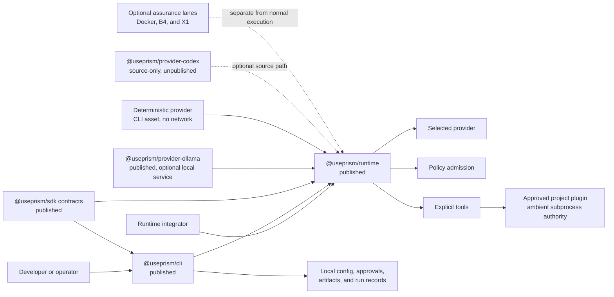
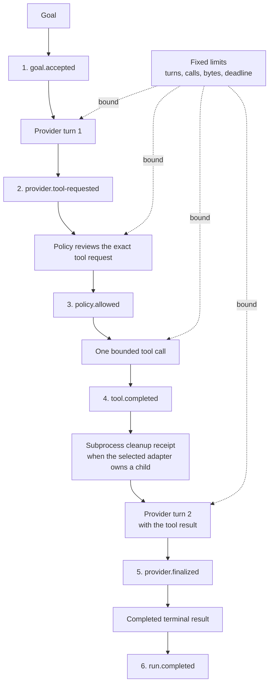
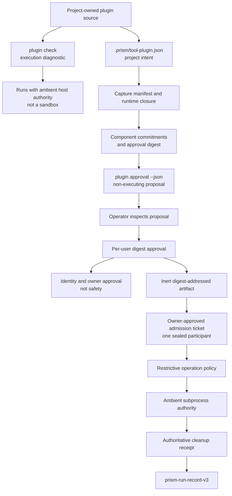
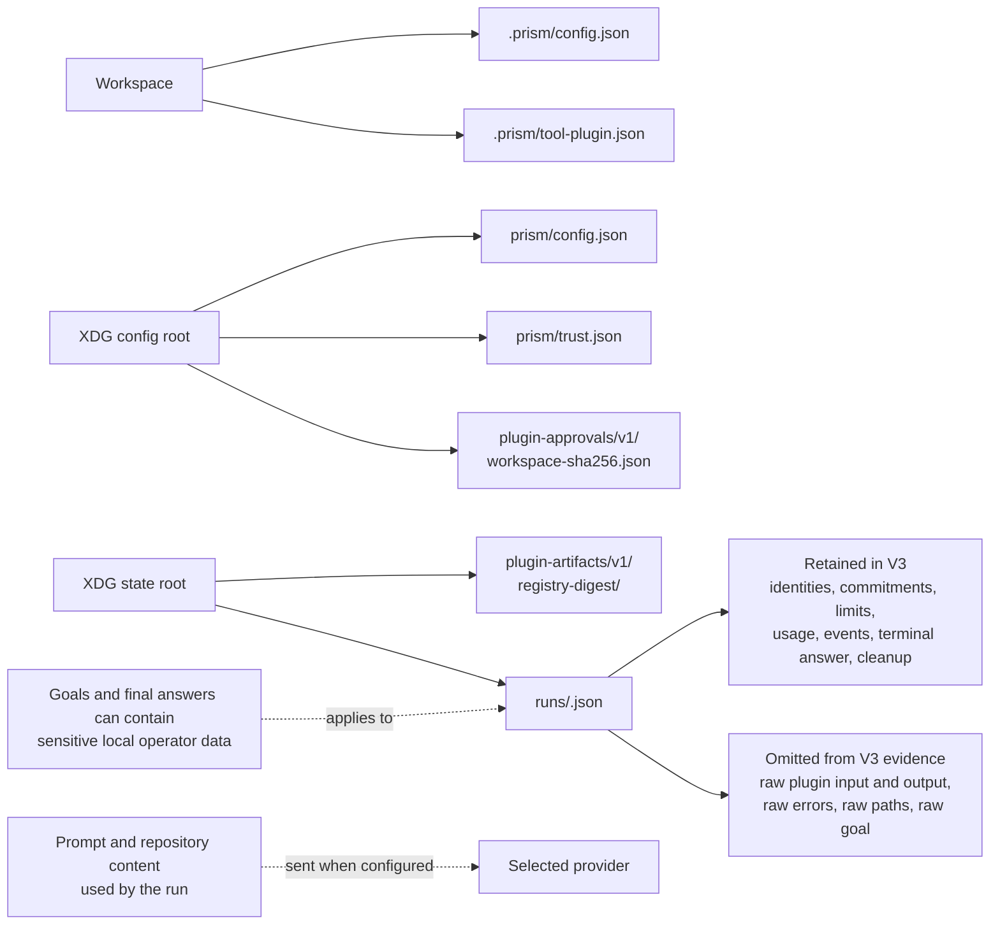
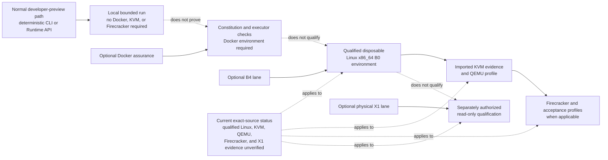

# Architecture

Prism 0.1.0 is a provider-neutral TypeScript runtime for bounded agent runs.
The CLI composes a provider, a policy, and explicit tools around Runtime. SDK
packages define the contracts. The CLI also owns local configuration, approval
records, artifacts, and run-record persistence.

These diagrams describe the shipped developer preview. Historical plans under
`docs/plans/` explain how the design developed, but they are not the current
product overview.

## System and packages

[Mermaid source](diagrams/system-and-packages.mmd)

Text equivalent: CLI users enter through `@useprism/cli`; library users enter
through `@useprism/runtime`. Runtime coordinates a selected provider, policy
admission, and explicit tools using contracts from `@useprism/sdk`. The
deterministic provider is a CLI asset. The Ollama adapter is published and
needs an operator-managed service. The Codex adapter is visible in source but
is not published. The CLI writes local state. Approved project plugins run as
ambient-authority subprocesses. Docker, B4, and X1 are separate assurance
lanes, not the normal execution path.

## Bounded run sequence

[Mermaid source](diagrams/bounded-run.mmd)

Text equivalent: Runtime accepts a goal, asks the provider for a decision,
passes each tool request to policy, invokes the admitted tool, and gives the
result back to the provider. It produces a terminal result after the second
provider turn. Fixed turn, call, byte, and deadline limits bound the loop. The
deterministic CLI composition emits the six events shown in order. An adapter
that starts a subprocess also owns its cleanup receipt.

## Project-plugin admission and execution

[Mermaid source](diagrams/plugin-admission.mmd)

Text equivalent: a project declaration records intent. `plugin approval`
captures the manifest and runtime closure and returns a non-executing proposal.
The operator inspects its commitments and approves that digest. Prism stores
the captured bytes as an inert artifact and gives Runtime an admission ticket
for one participant. A restrictive policy admits the declared operation. The
plugin then runs with the user's ambient host authority. The approval proves
identity and owner approval, not safety. Cleanup evidence is written into the
V3 run record. `plugin check` is a separate execution diagnostic and also runs
the plugin with ambient authority.

## Local data and evidence

[Mermaid source](diagrams/local-data-and-evidence.mmd)

Text equivalent: workspace configuration and tool intent stay under `.prism/`.
User configuration, endpoint trust, and approvals live under the XDG config
root. Artifacts and run records live under the XDG state root. V3 records keep
identities, commitments, limits, usage, events, the terminal answer, and
cleanup evidence. They omit raw plugin input, output, errors, paths, and the raw
goal. Final answers can still contain sensitive data. A configured provider
receives the prompt and any repository content used during the run.

## Optional assurance lanes

[Mermaid source](diagrams/assurance-lanes.mmd)

Text equivalent: the normal deterministic CLI and Runtime API paths do not
need Docker, KVM, QEMU, Firecracker, or X1. Docker checks are optional and do
not qualify the B4 or X1 lanes. B4 starts in a qualified disposable Linux x86_64
environment, then adds KVM and QEMU evidence before applicable Firecracker
profiles. Physical X1 qualification is separate and read-only. No fresh
qualified result for those environments is recorded for the exact current
source.

## Package responsibilities

| Package | Responsibility | Preview status |
| --- | --- | --- |
| `@useprism/sdk` | Provider, tool, policy, manifest, registration, and protocol contracts | Published |
| `@useprism/runtime` | Bounded execution, policy admission, tool calls, events, cleanup, and terminal results | Published |
| `@useprism/provider-ollama` | Ollama provider adapter for an operator-managed endpoint | Published |
| `@useprism/cli` | Composition, configuration, approval workflow, local artifacts, and run inspection | Published |
| `@useprism/provider-codex` | Source-visible Codex CLI compatibility adapter | Unpublished |

See [Concepts](../developer-preview/concepts.md), [Local data and
trust](../developer-preview/data-and-trust.md), and [Optional
assurance](../assurance/README.md) for the task-level details.
